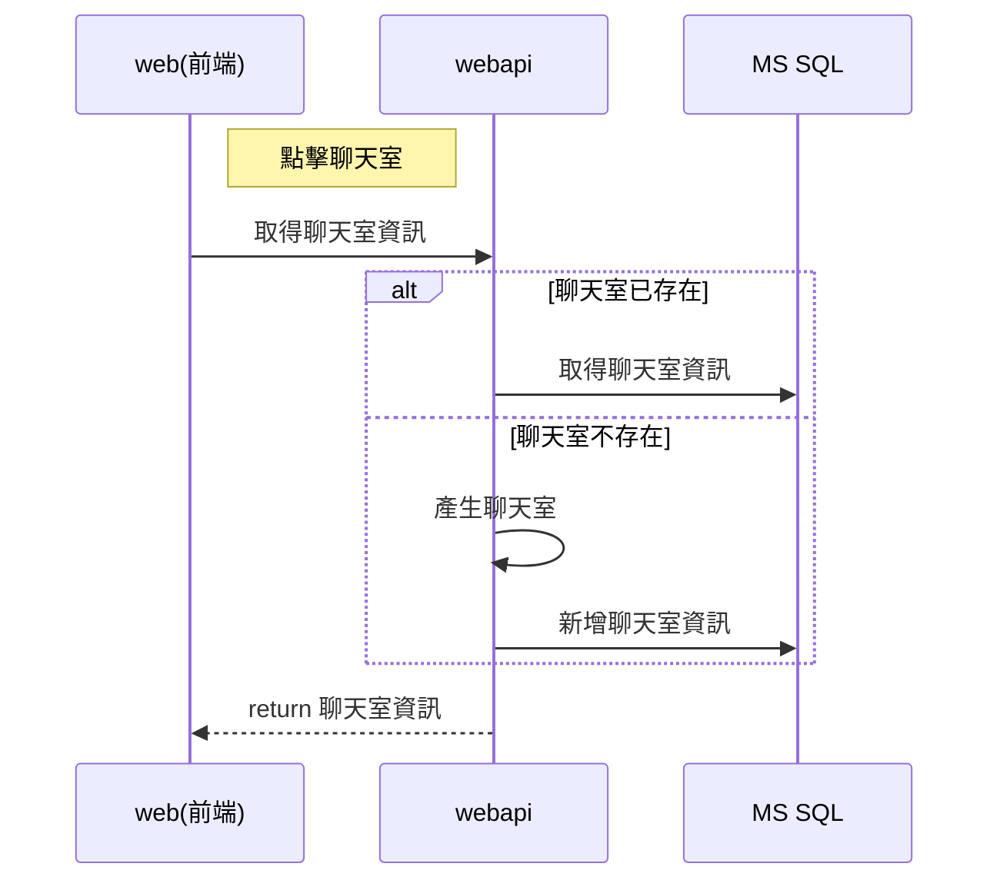
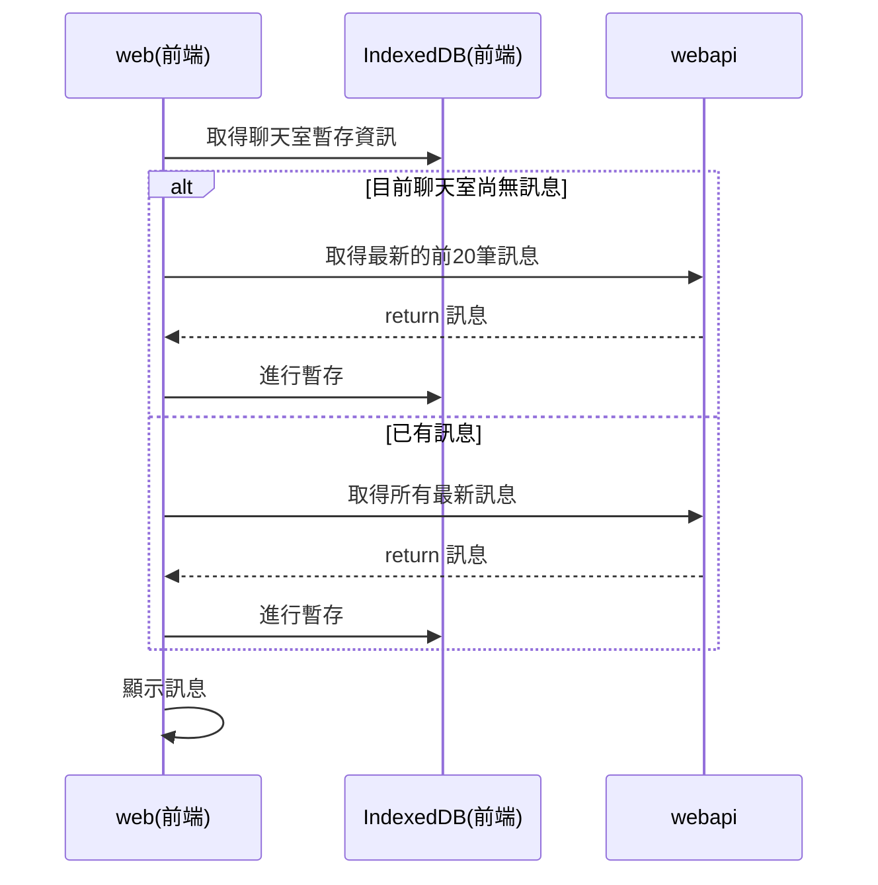
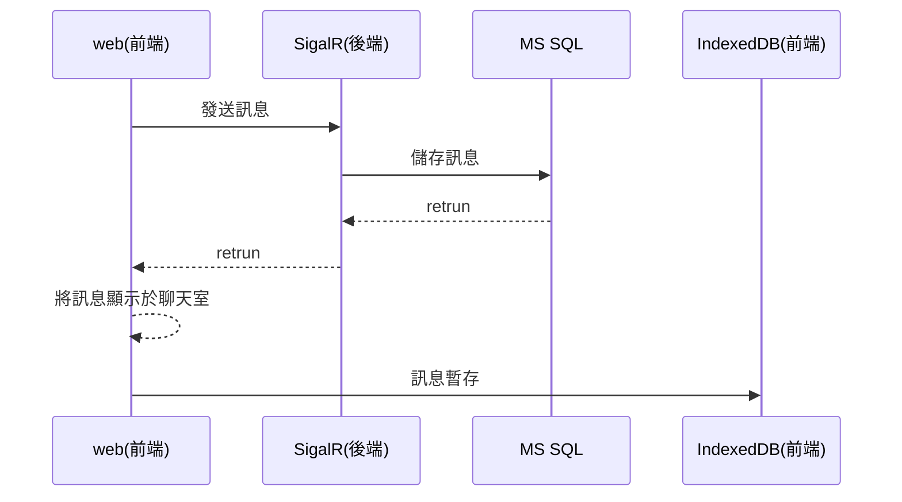

# 目錄

<!-- TOC -->

- [目錄](#%E7%9B%AE%E9%8C%84)
- [一、建立聊天室](#%E4%B8%80%E5%BB%BA%E7%AB%8B%E8%81%8A%E5%A4%A9%E5%AE%A4)
- [二、進入聊天室](#%E4%BA%8C%E9%80%B2%E5%85%A5%E8%81%8A%E5%A4%A9%E5%AE%A4)
- [三、載入舊訊息](#%E4%B8%89%E8%BC%89%E5%85%A5%E8%88%8A%E8%A8%8A%E6%81%AF)

<!-- /TOC -->
# 一、建立聊天室

# 二、進入聊天室

# 三、發送訊息

